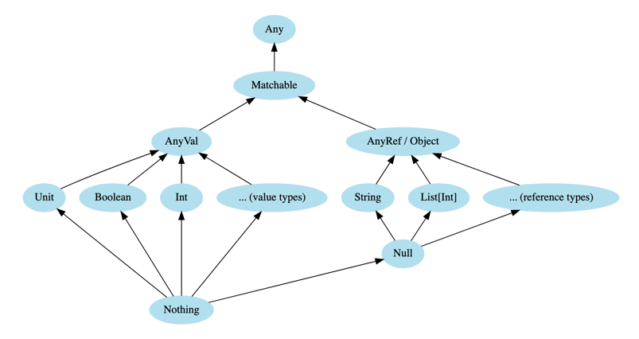

# Scala 3: A First Look at Types — Повний Конспект

## Part 1: Категорії та Вбудовані Типи


### Категорії:
- `Any` — надтип усіх типів
    - `AnyVal` — значення (Int, Double, Boolean, Unit…)
    - `AnyRef` — об’єктні типи (String, List…)

### Вбудовані типи:
```scala
val x: Int = 42
val s: String = "Scala"
val b: Boolean = true
def greet(): Unit = println("Hi")
```

---

## Part 2: Абстрактні Типи

### Any, AnyVal, AnyRef:
- `Any`: надтип усього
- `AnyVal`: надтип примітивів
- `AnyRef`: надтип об'єктів

### Unit:
```scala
def log(msg: String): Unit = println(msg)
```

### Nothing:
```scala
def fail(msg: String): Nothing = throw new Exception(msg)
```

### Null:
```scala
val s: String | Null = null
```

### Matchable:
```scala
def describe(x: Matchable): String = x match
  case i: Int => s"Int: $i"
  case s: String => s"String: $s"
  case _ => "Unknown"
```

---

## Part 3: Типи у Функціях та Псевдоніми

### Функції:
```scala
def square(x: Int): Int = x * x
val doubler: Int => Int = x => x * 2
val adder: (Int, Int) => Int = (a, b) => a + b
```

### Type Aliases:
```scala
type Name = String
type Age = Int
type Person = (Name, Age)
```

### Union-типи:
```scala
def stringify(x: Int | String): String = x match
  case i: Int => s"int: $i"
  case s: String => s"string: $s"
```

---

## Part 4: Opaque, Inferred, Literal Types

### Opaque:
```scala
object Logarithm:
  opaque type Log = Double
  def apply(x: Double): Log = math.log(x)
  def toDouble(log: Log): Double = log
```

### Inferred:
```scala
val name = "Scala"
val nums = List(1, 2, 3)
```

### Literal:
```scala
val On: true = true
def connect(mode: "safe" | "fast"): String = s"Connecting $mode"
```

## Type casting

