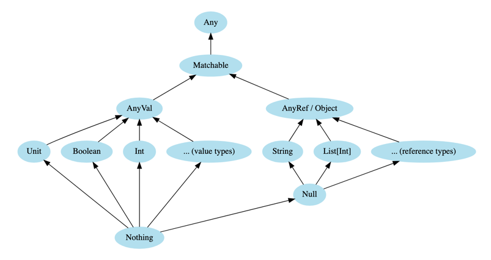

# Scala 3: A First Look at Types — Part 3: Абстрактні типи


## 1. Any

- Надтип усіх типів
- Може містити будь-що

```scala
val anything: Any = 42
```

## 2. AnyVal

- Надтип примітивних типів: Int, Boolean, Double, Unit тощо

## 3. AnyRef

- Надтип всіх reference-класів (String, List, Option)
- Аналог java.lang.Object

```scala
val obj: AnyRef = "text"
```

## 4. Unit

- Тип функції, що нічого не повертає
- Має єдине значення `()`

```scala
def log(msg: String): Unit = println(msg)
```

## 5. Nothing

- Підтип усіх типів
- Використовується для функцій, які не повертають значення

```scala
def fail(msg: String): Nothing = throw new Exception(msg)
```

## 6. Null

- Тип, що має єдине значення `null`
- Можна використовувати лише з об'єктними типами (`String | Null`)

## 7. Matchable

- У Scala 3 — базовий тип для pattern matching
- Забезпечує безпечний match навіть при використанні generic

```scala
def describe(x: Matchable): String = x match
  case i: Int => s"Int: $i"
  case s: String => s"String: $s"
  case _ => "Unknown"
```
