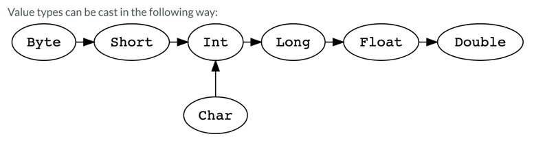

# Types

# 📘 Scala 3 — Inferred Types

---

## 🧠 Що таке Inferred Types?

**Inferred type** (виведений тип) — це тип, який **не вказується явно**, а визначається компілятором **на основі контексту**.



Scala має потужну систему виводу типів, що дозволяє писати чистіший і лаконічніший код.

---

## ✅ Приклади виводу типів

```scala
val x = 42
// Scala виводить: x: Int

val name = "John"
// name: String

val isEven = (n: Int) => n % 2 == 0
// isEven: Int => Boolean

val names = List("Alice", "Bob", "Charlie")
// names: List[String]
```

---

## 📌 Inferred return types for methods

```scala
def add(a: Int, b: Int) = a + b
// Тип: (Int, Int) => Int

def greet(name: String) = s"Hello, $name"
// Тип: String => String
```

> Якщо тіло однострічне — Scala виведе тип автоматично

---

## 🔒 Коли краще вказувати тип явно?

- Публічні API
- Якщо тип складний або неочевидний
- Для документації або читаємості
- При використанні `def`, щоб уникнути небажаних змін типу
- Для уникнення помилок в IDE

---

## ❌ Потенційні ризики

```scala
def compute() = { println("doing..."); 42 }
// тип: Unit (!) — не те, що очікувалось

val items = List(1, 2.0, "three")
// тип: List[Any] — можливо, не те, що хотіли
```

---

## 💡 Порада

> Якщо щось не працює — наведи курсор або наведи `:t` у REPL:  
> `scala> val x = List(1, 2, 3)`  
> `val x: List[Int] = List(1, 2, 3)`

---

## 🧠 Питання для співбесіди

### ❓ Що таке вивід типів у Scala?

> Це можливість компілятора автоматично визначити тип змінної або результат функції, без явної вказівки типу.

---

### ❓ Коли краще вказати тип явно?

> Коли тип складний, публічний, або може бути неоднозначним. Для підвищення зрозумілості та безпеки.

---

### ❓ Чому виведення типу може бути ризикованим?

> У складному виразі тип може виявитись неочікуваним (`Any`, `Unit`, тощо), що призведе до помилок.

---

### ❓ Виводиться тип значення чи функції?

> Виводяться **типи виразів**, а не лише значень. Scala намагається вивести максимально точний тип.

---

## 📌 Висновок

| Коли покладатися на Inferred Types | Коли явно вказувати тип |
|------------------------------------|--------------------------|
| Простий, очевидний тип             | Публічний API            |
| Однострічна функція                | Документація, IDE        |
| Локальні змінні                    | Важливі типи (наприклад, `Future[Result]`) |
| Lambda-функції                     | Високий рівень абстракції|

---

Scala → лаконічна, але **контрольованість типів** — важливий елемент чистого коду