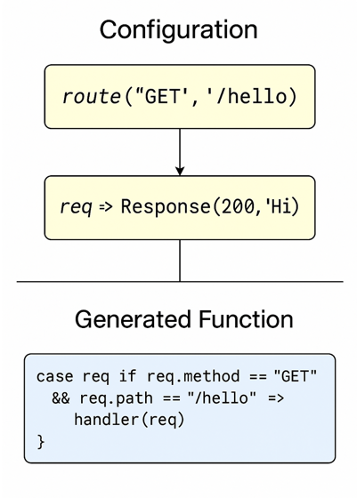
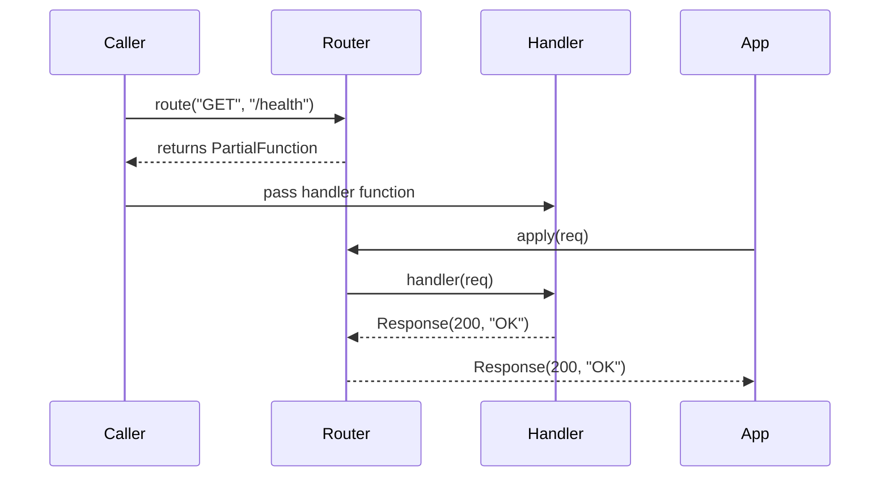

## Концепти

| Потреба                             | Рішення через функції                                         | Приклад із реального коду                                           |
| ----------------------------------- | ------------------------------------------------------------- | ------------------------------------------------------------------- |
| 🔧 **Повторне використання логіки** | **Повертаємо функцію** — генератор поведінки на параметрах    | Валідатор: `minLengthValidator(5)` повертає `String => Boolean`     |
| ⚙ **Конфігурованість**              | Функція **замкнула параметр** — ти більше не передаєш його    | `makeDiscountFunc(10%)` → потім просто `f(price)`                   |
| ♻ **Комбінування функцій**          | `val f = a => a + 1; val g = a => a * 2; val h = f andThen g` | Композиція трансформацій JSON, форм, даних                          |
| 🧼 **Інкапсуляція деталей**         | Ти повертаєш тільки API — а реалізація прихована              | `getAuthStrategy(config)` повертає готову функцію, як "чорний ящик" |
| 💬 **Вираження наміру**             | "Я повертаю інструмент", а не "результат"                     | `makeRouter()` повертає HTTP-роутер функцію: `Request => Response`  |

# Повноцінний функціональний DSL-фреймворк:

- **Методи повертають функції** → для генерації поведінки.
- **Каррінг** → для декларативного створення маршрутів.
- **PartialFunction +** orElse → комбінація логіки, як LEGO.
- **Middleware** → модульна обробка запитів.
- **Інжекція логера** → передача залежностей без OOP-контейнерів.

## 🔧 Що можна додати далі:

- DSL з given-конфігурацією
- Async/Future підтримку
- HTTP-інтерфейс через sttp або http4s
- Unit-тести на обробку маршрутів

## Висновки — ми реалізували

| Концепт                        | Реалізація                                    |
| ------------------------------ | --------------------------------------------- |
| ✅ **Каррінг**                  | `route("GET", "/") { req => ... }`            |
| ✅ **Інкапсуляція**             | метод `route` ховає внутрішню логіку          |
| ✅ **Функція повертає функцію** | `makeApp(...)` повертає `Request => Response` |
| ✅ **DSL-подібний синтаксис**   | `route(...)(_ => Response(...))`              |
| ✅ **Конвеєр (middleware)**     | `withMiddleware(mw)(handler)`                 |
| ✅ **Інжекція залежностей**     | `routeWithLogging(logger)(...)`               |

Mermaid sequence diagram

